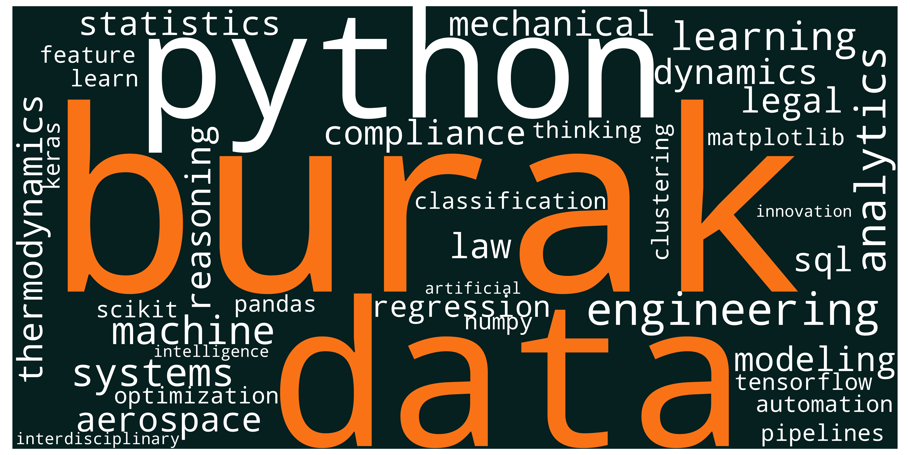

# 🐝 Multidisciplinary Data Visualization with Python

A Python-based data visualization project exploring how engineering, legal reasoning, and data science can be represented through structured analytical visualization.

This project demonstrates the use of text processing and visualization techniques to create a domain-focused WordCloud representation.

🔗 Part of my AI & Data portfolio:
https://burakari.com

---

## 📌 Project Objective

The goal of this project is to visualize the intersection of multiple disciplines through structured keyword mapping and graphical representation.

It reflects how different domains connect under a data-driven and systems-oriented mindset.

---

## 🧠 Methodology

- Defined domain-specific keyword sets
- Structured textual data
- Generated a customized WordCloud visualization
- Styled and rendered output using Matplotlib
- Ensured reproducibility within a Jupyter Notebook environment

---

## 📊 Output



---

## 🛠 Tech Stack

- Python
- WordCloud
- Matplotlib
- Jupyter Notebook

---

## ▶️ How to Run

1. Clone the repository:

```bash
git clone https://github.com/burakari/multidisciplinary-data-visualization.git
